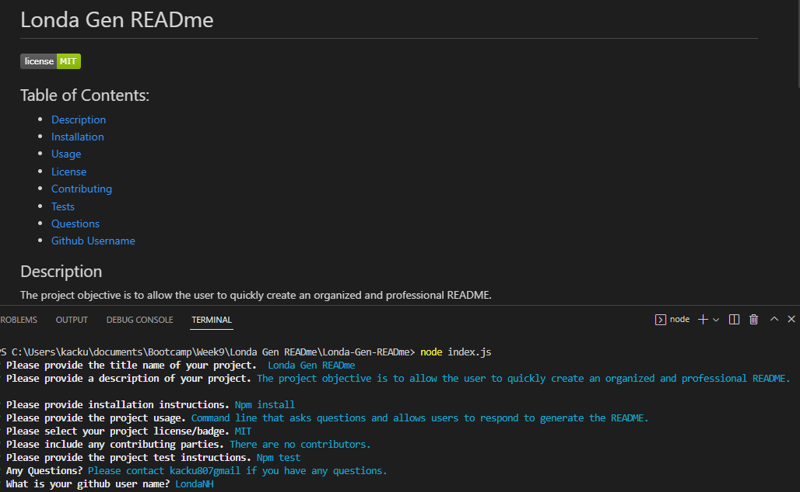

# Londa-Gen-READme

## Action Needed
Use starter code to create an auto READme generator application that popluates data based on prompted questions.  

##  Actions Taken
* Used Inquirer package to give the user with a series of questions via the command-line interface to answer to generator the readme. 
* The user was provided with "list" prompt to allow them to select a license. 
* The "writefile" function was used to write the inputs onto the README. 
* The "init" function was used to initilize the application. 
* The licenseLink function was used so that the license selected will display as a badge on the read me. 
* The generate markdown function was used to display the inputted information in an organized and professional manner. 

## Video Link
https://drive.google.com/file/d/1Yd29y1TtR8M3vbVkt0-2mAqEMcdaG-eY/view

## GitHub Link
https://github.com/LondaNH/Londa-Gen-READme

## Screenshot
